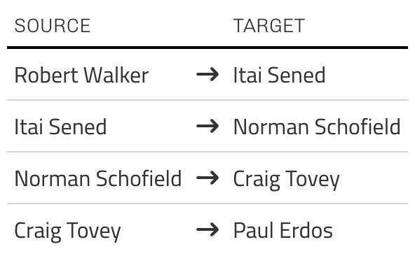
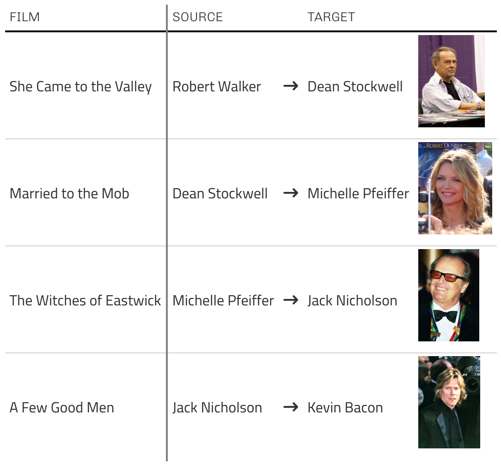

```{r setup, include=FALSE}
library(distilltools)
library(tidyverse)
library(gt)
library(gtExtras)
```

* [Robert W. Walker's Curriculum vitae](./images/cv/vita.pdf){target="_blank"}   

::: {.panel-tabset}

## About

:::::: columns

::: {.column width="45%"}

:::

::: {.column width="5%"}
:::

::: {.column width="50%"}
Robert W. Walker is an Associate Professor of Quantitative Methods in the [Atkinson Graduate School of Management](https://willamette.edu/mba/admission/index.html) at [Willamette University](https://willamette.edu/)

He earned a Ph. D. in political science from the University of Rochester in 2005 and has previously held teaching positions at Dartmouth College, Rice University, Texas A&M University, and Washington University in Saint Louis. His current research develops and applies semi-Markov processes to time-series, cross-section data in international relations and international/comparative political economy. He teaches courses in quantitative methods/applied statistics and microeconomic strategy and previously taught four iterations in the U. S. National Science Foundation funded Empirical Implications of Theoretical Models sequence at Washington University in Saint Louis. His work with Curt Signorino and Muhammet Bas was awarded the Miller Prize for the best article in Political Analysis in 2009.

His web presence is [robertwwalker.work](https://robertwwalker.work/) and his github is <https://github.com/robertwwalker>.
:::
::::::


::: {.highlight-box}
**Warren Miller Prize**

With Curt Signorino and Muhammet Bas, I was awarded the Warren Miller Prize for *Statistical Backwards Induction* —- recognizing the finest contribution to Political Analysis -- with a deployment of resampling and standard logistic regression tools.
:::


## Education

**PhD Political Science** (2005)  
University of Rochester

**MA Political Science** (2002)  
University of Rochester

**BA Post-Soviet and East European Studies** (1995)  
University of Texas at Austin

**Страноведение России** (1994)  
Московский государственный лингвистический университет


## Erdos-Bacon

Robert's Erdos-Bacon Number is 8.

:::::: columns

::: {.column width="45%"}

### Erdos Number 4

```{r, message=FALSE, warning=FALSE, echo=FALSE}
Bacon.Table <- data.frame(Film = c("She Came to the Valley", "Married to the Mob", "The Witches of Eastwick", "A Few Good Men"), Source = c("Robert Walker", "Dean Stockwell", "Michelle Pfeiffer", "Jack Nicholson"), FA = rep("arrow-right-long", 4), Target = c("Dean Stockwell", "Michelle Pfeiffer", "Jack Nicholson", "Kevin Bacon"), URL = c("https://upload.wikimedia.org/wikipedia/commons/3/3b/Dean_Stockwell_01_%286940352648%29.jpg","https://upload.wikimedia.org/wikipedia/commons/7/70/Michelle_Pfeiffer_2007.jpg","https://upload.wikimedia.org/wikipedia/commons/e/ec/Jack_Nicholson_2001.jpg","https://upload.wikimedia.org/wikipedia/commons/9/98/Kevin_Bacon_Cannes_2004.jpg"))
Res.1 <- Bacon.Table %>%
  gt() %>%
  fmt_icon(columns = FA) %>%
  gt_img_rows(column = URL, img_source="web", height = 100) %>%
  gt_theme_538() %>%
  cols_label(FA = "", URL = "")  %>%
  gt_add_divider(Film)  %>%
  gtsave(., "Bacon.png", path="images/")
Erdos.Table <- data.frame(Source = c("Robert Walker", "Itai Sened", "Norman Schofield", "Craig Tovey"), FA = rep("arrow-right-long", 4), Target = c("Itai Sened", "Norman Schofield", "Craig Tovey", "Paul Erdos"))
Erdos.Table %>%
    gt() %>%
  fmt_icon(columns = FA) %>%
  gt_theme_538() %>%
  cols_label(FA = "") %>%
  gtsave(., "Erdos.png", path="images/")
```


:::

::: {.column width="5%"}
:::

::: {.column width="50%"}

### Bacon Number 4



:::

::::::

## Location


:::::: columns

::: {.column width="45%"}

-   [Appointments](https://rww.youcanbook.me)

-   [Zoom](https://willametteuniversity.zoom.us/my/robertwalker){target="_blank"}

-   [Google Scholar](https://scholar.google.com/citations?user=FU8pL7sAAAAJ&hl)

-   **Office Hours: 1300 to 1500 Pacific time on Wednesdays**

:::

::: {.column width="5%"}
:::

::: {.column width="50%"}

```{r Map, echo=FALSE, message=FALSE, warning=FALSE}
library(leaflet)
content <- paste(sep = "<br/>",
  "<b>Kaneko 208</b>",
  "1314 Mill St SE",
  "Salem, OR 97301",
  "Enter Kaneko Building",
  "2nd floor; East end of the hall",
  "Office 208"
)
m <- leaflet() %>% 
  setView(lng = -123.026479, lat = 44.933186, zoom = 15) %>%
  addTiles() %>%
  addPopups(-123.026479, 44.9332, content,
    options = popupOptions(closeButton = FALSE)
  )
m
```
:::

::::::

:::